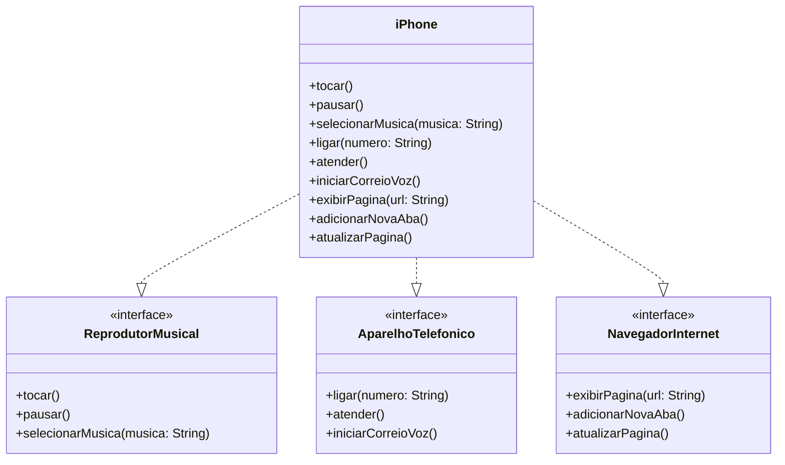

```mermaid
classDiagram
    class ReprodutorMusical {
        <<interface>>
        +tocar()
        +pausar()
        +selecionarMusica(musica: String)
    }
    class AparelhoTelefonico {
        <<interface>>
        +ligar(numero: String)
        +atender()
        +iniciarCorreioVoz()
    }
    class NavegadorInternet {
        <<interface>>
        +exibirPagina(url: String)
        +adicionarNovaAba()
        +atualizarPagina()
    }
    class iPhone {
        +tocar()
        +pausar()
        +selecionarMusica(musica: String)
        +ligar(numero: String)
        +atender()
        +iniciarCorreioVoz()
        +exibirPagina(url: String)
        +adicionarNovaAba()
        +atualizarPagina()
    }
    iPhone ..|> ReprodutorMusical
    iPhone ..|> AparelhoTelefonico
    iPhone ..|> NavegadorInternet
```
